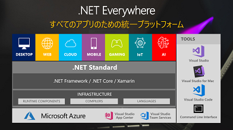

# Sample project for .NET session [AD14] of the de:code 2018

I'd like to share a sample project for Xamarin, .NET Standard 2.0 and Cognitive Services which was created for AD14 session of the de:code 2018.

**You can see the session video on YouTube:<br/>
[.NET Everywhere ～ .NET が創る Mobile & Cloud Native プラットフォームの未来](https://youtu.be/NYgv1ftlM9M)**

**And you can download the deck as PDF here:<br/> [decode2018_PDF_AD14.pdf](https://eventmarketing.blob.core.windows.net/decode2018-after/decode2018_PDF_AD14.pdf)**

 

## This sample code is:

*   **Based on the sample source code from [Visual Search mobile app tutorial](https://docs.microsoft.com/azure/cognitive-services/bing-web-search/computer-vision-web-search-tutorial)**. For a more details of this sample, please see the tutorial document.
*   Created as a project for [Visual Studio 2017 - 15.7.3](https://www.visualstudio.com/vs/).
*   Included iOS, Android and UWP project using Xamarin.Forms 3.0
*   Created using .NET Standard 2.0
*   Using [Media Plugin for Xamarin and Windows](https://github.com/jamesmontemagno/MediaPlugin)

## To use this sample is needed to setup Azure Cognitive Services API Key, Custom Vision model and prediction URL/Key:
1. Go to [Cognitive Services: Computer Vision API](https://azure.microsoft.com/ja-jp/try/cognitive-services/?api=computer-vision) and sign up for computer vision API.
2. Go to [Custom Vision Service](https://azure.microsoft.com/ja-jp/services/cognitive-services/custom-vision-service/) and sign up for custom vision, and create some model with photos that you would like to predict.
3. Add your API keys for Cognitive Services in **App.xaml.cs** as follows.

```C#:App.xaml.cs
public partial class App : Application
{
    public App()
    {
        InitializeComponent();

        //Applicable OCR server locations(at time of writing) are: westus, eastus2, westcentralus, westeurope, southeastasia
        AppConstants.SetOcrLocation("westus");

        //
        // Add your API keys of Cognitive Services.
        //
        AppConstants.ComputerVisionApiKey = "{Your API Key here}";
        AppConstants.BingWebSearchApiKey = "{Your API Key here}";

        AppConstants.CustomVisionApiKey = "{Your Custom Vision API Key here}";
        AppConstants.CustomVisionApiUrl = "{Your Csutom Vision Prediction URL for image file here}";
        // ex. https://southcentralus.api.cognitive.microsoft.com/customvision/v1.0/Prediction/xxxxxx/image?iterationId=yyyyyy

        MainPage = new NavigationPage(new OcrSelectPage());
    }

    ...
}
```

Have fun!<br/>
Akira "chack" Inoue.

*This project has adopted the [Microsoft Open Source Code of Conduct](https://opensource.microsoft.com/codeofconduct/). For more information see the [Code of Conduct FAQ](https://opensource.microsoft.com/codeofconduct/faq/) or contact [opencode@microsoft.com](mailto:opencode@microsoft.com) with any additional questions or comments.*


---
services: cognitive-services,bing-web-search, computer-vision 
platforms: csharp, xamarin
author: Aristoddle

# Visual Search App with Cognitive Services

This sample illustrates how the [Computer Vision API](https://azure.microsoft.com/services/cognitive-services/computer-vision/) and [Bing Web Search API](https://azure.microsoft.com/services/cognitive-services/bing-web-search-api/) can be used together to build a simple visual search application.  

For a more in-depth discussion of this sample, see the [Visual Search mobile app tutorial](https://docs.microsoft.com/azure/cognitive-services/bing-web-search/computer-vision-web-search-tutorial).

## The Sample
This sample is a Xamarin.Forms application which uses the Computer Vision and Bing Web Search RESTful APIs to parse text from images and then query that text on Bing.  It can import photos or capture them with the OS-default camera on Android, iOS, or the Universal Windows Platform.  


### Build the sample

1. Ensure that you've installed the **Mobile development with .NET** package from the Visual Studio Installer.

2. Start Microsoft Visual Studio 2017 and select `File > Open >
    Project/Solution`.
    
3. Navigate to the folder where you cloned this repository.

4. Open the Visual Studio Solution (.sln) file `VisualSearchApp.sln`.  It may take a few minutes for the project to initialize.

5. Open the NuGet Package Manager (right click your solution in the solution explorer, and select `Manage NuGet Packages For Solution`)

6. Install the **Xamarin Media Plugin** (Xam.Plugin.Media) and **Json.NET** (Newtonsoft.Json) packages.

7. Select your target platform from the ribbon menu at the top of your Visual Studio window.

8. Build and run the sample from this same ribbon menu.

### Run the sample
After building the sample, you should be taken to a screen where you are asked to input your Bing Web Search and Computer Vision API Keys.  To attain 30-day trial keys to these APIs, see [this page](https://azure.microsoft.com/try/cognitive-services/).  For more information about attaining keys for professional use, see [Pricing](https://azure.microsoft.com/pricing/calculator/).

After inputting the keys, you will be taken to a screen where you can import or capture a photo and feed that photo to the relevant OCR endpoint for text extraction.  

This will open a table of parsed text, which you can select to query using the Bing Web Search API.

Each of these Bing results can be selected to render the relevant webpage.

## License
All Microsoft Cognitive Services SDKs and samples are licensed with the MIT License. For more details, see
[LICENSE](https://microsoft.mit-license.org/).


## Developer Code of Conduct
Developers using Cognitive Services, including this client library & sample, are expected to follow the “Developer Code of Conduct for Microsoft Cognitive Services”, found at [http://go.microsoft.com/fwlink/?LinkId=698895](http://go.microsoft.com/fwlink/?LinkId=698895).

